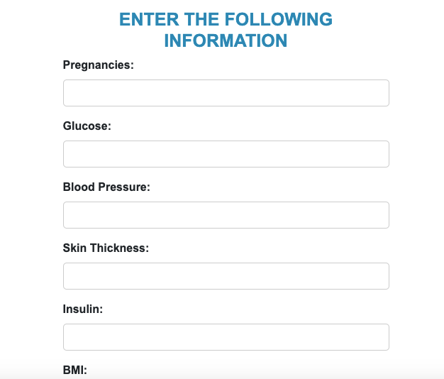
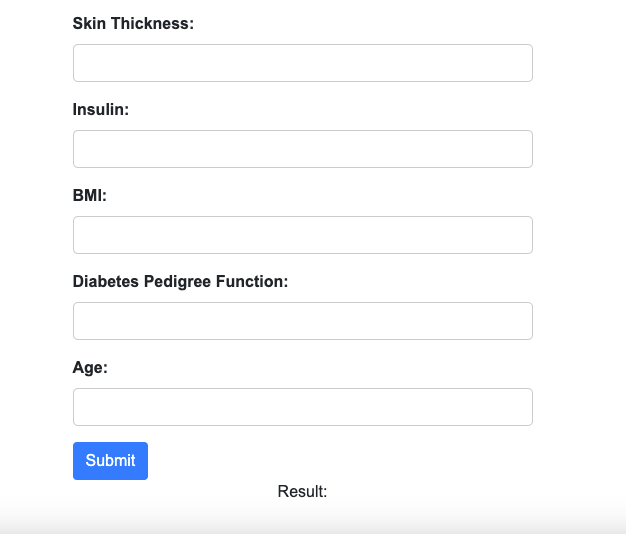

# Diabetes Regression : 
### <ins>Installation :</ins>
```bash
$ git clone https://github.com/AnasNedday/DiabetesAnalystDjango.git
$ cd DiabetesAnalystDjango
$ pip install requirements.txt
```
#### <ins>TO RUN THE  PROJECT :</ins>
```bash
$ cd DiabetesPrediction
$ python manage.py migrate
$ python manage.py runserver
```
```python
Starting development server at http://127.0.0.1:8000/
```
```python
##Important: 
Change the dataset diabetes.csv Path in views.py
```

#### <ins> Home page :</ins>


#### <ins> App Form :</ins>

